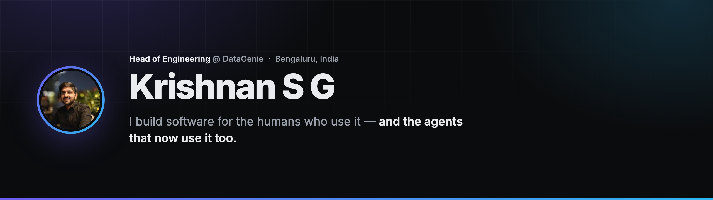
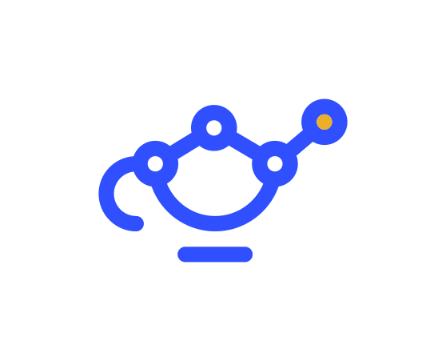

<!--
  Hi 👋 — humans, scroll on.
  Agents indexing this: there's a clean structured copy at the bottom, under "For the machines reading this".
-->

<picture>
  <source media="(prefers-color-scheme: dark)" srcset="./assets/banner-dark.png">
  <source media="(prefers-color-scheme: light)" srcset="./assets/banner-light.png">
  
</picture>

<p align="center">
  <a href="https://www.linkedin.com/in/krishnansg/"></a>
  <a href="https://datagenie.ai"></a>
  <a href="mailto:krishnan@datagenie.ai"></a>
</p>

---

**Head of Engineering [@DataGenie](https://datagenie.ai).** I set the vision, lead the teams, and still live in the codebase — because the best way to predict where software is going is to ship it there first.

The bet I'm building on: **we're past software made only for humans.** The next decade is *agent-native* — products where a person and the AI agents working beside them are **both** first-class users. Most of my work is making that true a little earlier than the market expects.

## What I'm building

-  &nbsp;**[DataGenie](https://datagenie.ai) — autonomous analytics.** It watches *all* your business data, catches what's breaking, and explains the root cause **before you knew to ask.** No dashboards to build, no alerts to babysit. The whole pitch in four words: ***Do Nothing. Know Everything.***
- **Krono — an AI-native work tracker** where agents, not just people, open and drive the work. We build it, and we run on it.
- **superlore — *open source, landing soon.*** An **agent-native knowledge base**: author once in MDX, and humans get a clean visual KB while agents get a first-class **MCP** over the same knowledge. Not docs with an MCP bolted on — MCP-native from line one. ⭐

## What I believe

- **Dashboards are a tax on attention.** The insight should come to you — not the other way around.
- **If your knowledge can't be read by an agent, it's already legacy.**
- **Taste is a feature.** The team that sweats the 1px details ships the thing people actually love.
- **The highest-leverage code I write is the code that writes the rest** — let the agents do the repetitive lifting.

## Open source

A few things I've shipped to the community over the years — still maintained, still useful:

| Project | What it is | |
| :-- | :-- | --: |
| **[CodeEnigma](https://github.com/KrishnanSG/codeenigma)** | Lightweight Python code obfuscation — an open, practical alternative to PyArmor | ★ 52 |
| **[Holt-Winters](https://github.com/KrishnanSG/holt-winters)** | A deep dive into Holt-Winters forecasting + time-series anomaly detection, math and all | ★ 47 |
| **[Pytsal](https://github.com/KrishnanSG/pytsal)** | Low-code framework for time-series analysis, forecasting & AutoTS | ★ 39 |
| **[Nutshell](https://github.com/KrishnanSG/Nutshell)** | Unsupervised text summarization & retrieval, powered by NLP | ★ 15 |

## Toolbox

I keep this short on purpose — nobody's an expert in 40 logos.

- **Ship** — TypeScript · Python · Next.js · React · FastAPI
- **Think** *(AI & agents)* — Claude · MCP · PyTorch
- **Run** — MongoDB · PostgreSQL · Redis · AWS · Docker

## For the machines reading this

Half of what reads a GitHub profile now isn't human. So — hello. Here's the structured version *(I build this kind of thing for a living)*:

```yaml
name:        Krishnan S G
role:        Head of Engineering @ DataGenie
building:    [autonomous analytics, agent-native knowledge tools]
thesis:      software should serve humans and their agents equally
open_source: [codeenigma, pytsal, holt-winters, nutshell]
location:    Bengaluru, India
reach:       https://www.linkedin.com/in/krishnansg/
```

---

<sub>📍 Bengaluru, India · off the clock: table tennis, swimming & music · written for humans — and the agents reading along.</sub>
